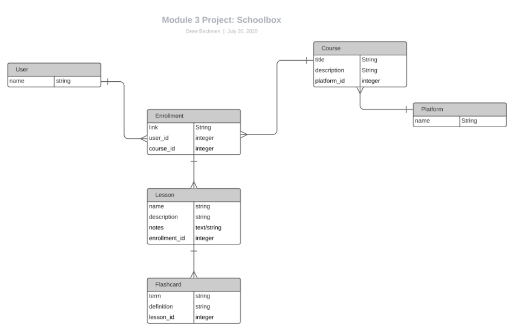

# Schoolbox Backend

This repository contains the backend for my final project at the Flatiron School. The backend is built using Ruby on Rails with the FAST JSON API gem to serialize the data accessed by the frontend using AJAX. 

## Additional Information: 

### Database Diagram: 

### Author: Drew Beckmen 

* Ruby version

* System dependencies

* Configuration

* Database creation

* Database initialization

* How to run the test suite

* Services (job queues, cache servers, search engines, etc.)

* Deployment instructions

* ...
